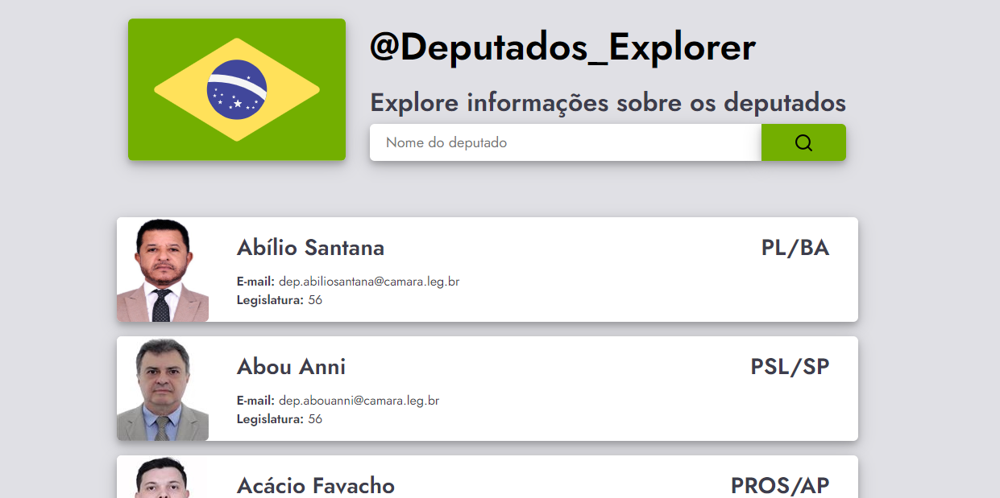
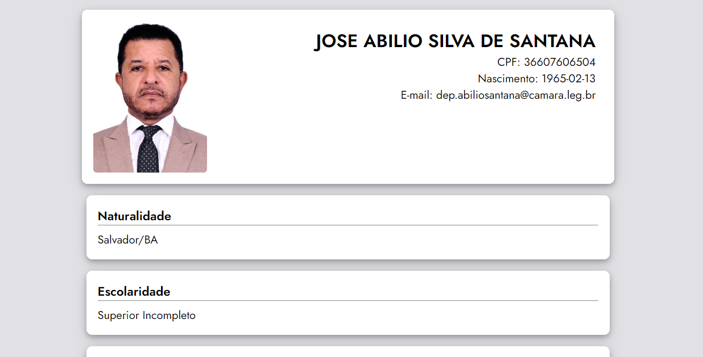

<br />
<p align="center">
    
</p>
<br />
<br />

<p align="center">

  <a href="LICENSE" style="text-decoration: none">
    
  </a>

  <a href="https://github.com/wesleyfeitosa/deputados-explorer/issues" style="text-decoration: none">
    
  </a>

  <a href="https://github.com/wesleyfeitosa/deputados-explorer/stargazers" style="text-decoration: none">
    
  </a>

  <a href="#" style="text-decoration: none">
    
  </a>

</p>

---

## :rocket: Technologies

This project was developed with the following technologies:

- [React](https://reactjs.org)
- [Styled Components](https://styled-components.com/)
- [API Câmara dos Deputados](https://dadosabertos.camara.leg.br/swagger/api.html)

## 💻 Project

This application provides a graphical interface for voters to search for their deputies, the application uses the open data api of the Federal Chamber of Deputies of Brasil.




## :hammer: Deploy

- Frontend: https://deputados-explorer.wesleyfeitosa.com.br/

## 🤔 How to contribute

- Fork this repository;
- Create a branch with your feature: `git checkout -b minha-feature`;
- Commit your changes: `git commit -m 'feat: Minha nova feature'`;
- Push to your branch: `git push origin minha-feature`.

After the merge of your pull request is done, you can delete your branch.

## 🔖 How to run

#### Cloning the project
```sh
git clone https://github.com/wesleyfeitosa/deputados-explorer.git
cd deputados-explorer
yarn
```
#### Starting Frontend
```sh
yarn start
```

## :memo: License

This project is under the MIT license. See the file [LICENSE](LICENSE) for more details.

---

Made with 💜 by Wesley Feitosa :wave:
